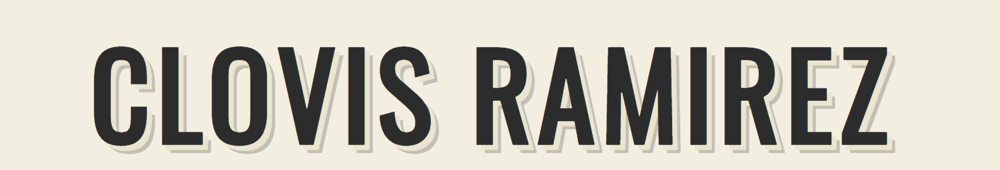

Been two years and a bit since I landed my first job as a Software Developer. Back then, the web was widely unknown for me.

One of my first tests was making a blog page. It is not only a great place to express personal ideas, but also a very good starter exercise to know more about the web. Basic CRUD operations and few database relationships. Starting with posts and then adding comments, replies, all that sort of stuff. Possibilities are endless. Eventually you expand your horizons, and so that simple blog page that caused so much joy becomes trivial. You learn your lesson and move on to more complex systems.

(By the way, I still conserve my [first blog app](https://github.com/clovis1122/blog-page)).

Some months (or years) later, one might or might not feel that one have adquired some knowledge. And want too share it. Prevent others from going through the same pitfalls, or show how to do that new shinny thing. Be like those authors that we've always been reading when looking for answers online. And it would not be wrong to start looking sites like [medium](https://medium.com) or [dev.to](https://dev.to) as the ideal place to post. Perhaps the company's blog is a good idea? Nowadays there aren't much incentives to manage a blog by oneself. I used these platforms (and still do!) as a start, but quickly realized that I want to make my own tweaks, leading me to create my own blog a year ago.

It was a great learning experience to me. Buying the domain, configuring Wordpress, getting lost between thousands of templates, configuring SSL and routing. As I became more interested on serverless, and also to reduce the costs, I switched to AWS S3 and started to manage a static website. Everything was wonderful. Had a couple of ideas on how to continue, none of which got to materialize. Eventually decided that I wanted to try out static site generators like Jekyll or Gatsby.

And so... guess the winner 😬.

On this blog I'm planning to post thoughts and entries related to my Software Engineering Journey. At some point I hope to add multi-language support and others nifty features. Stay turned.